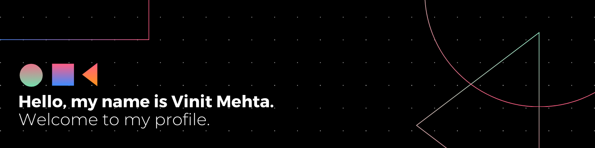

## About me

- **Senior Computer Science Student** @ [IIIT Hyderabad](https://www.iiit.ac.in).
- **Undergraduate Researcher** at [Machine Learning Lab](https://www.linkedin.com/company/mll-iiith/) @ IIIT-H
- **Interests**: 3D Computer Vision • Robotics • Distributed Systems • Applied Machine Learning
- PORs:
  - ex-[Sports Secretary](https://clubs.iiit.ac.in/clubs/sports_secretary/members) IIIT-H
  - ex-**Finance Head** [Felicity](https://felicity.iiit.ac.in/)
  - ex-**Logistics Head** [Art Society](https://clubs.iiit.ac.in/clubs/artsociety/members)
  - ex-**Coordinator** Mess
  - ex-**Member** [Electronics and Robotics Club](https://clubs.iiit.ac.in/clubs/roboticsclub/members)

I am passionate about creating innovative solutions. I enjoy diving into the world of technology to build meaningful projects. When not in front of the screen, you'll find me immersed in a good book, expressing myself on canvas, spiking a volleyball, or simply enjoying the rhythm of my favorite tunes. Let's connect and explore the endless possibilities of tech and creativity!

## Technical skills

### Programming Languages

### Frameworks & Libraries

### Tools & Platforms

## Connect with me

&nbsp;

&nbsp;

&nbsp;

&nbsp;

  
  &nbsp;&nbsp;&nbsp;&nbsp;&nbsp;
  
  &nbsp;&nbsp;&nbsp;&nbsp;&nbsp;
   

  <i>Always happy to help XD</i>

